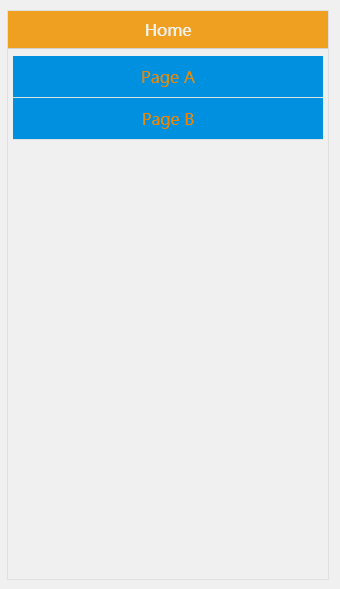
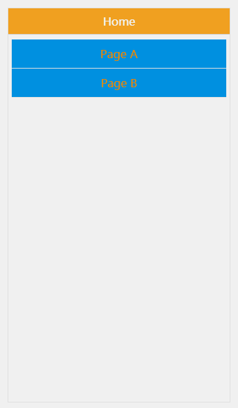

# vue-router 页面切换动画
网上一直没翻到 `vue-router` 翻页动画的完美实现，就心[bei]动[bi]的，编了一个简单的动画组件。支持简单的前进后退的左右动画，针对不支持 `history.state` 的浏览器，也能支持简单的透明动画。

献上效果图:



可下载此项目，打开 `test.html`，点击浏览器的前进、后退按钮，观看具体效果。

## 使用

使用前，请确保项目内，已经使用了 `vue-loader`。

在需要动画的页面中，引用 `src/vue-page-animation.vue` 文件，并且在 `router-view` 组件中，添加 `class="vue-page-animation-router-view"`，具体如下:
```html
<template>
  <div class="app">
    <VuePageAnimation>
      <keep-alive>
        <router-view class="vue-page-animation-router-view"></router-view>
      </keep-alive>
    </VuePageAnimation>
  </div>
</template>

<script>
import VuePageAnimation from '../src/vue-page-animation';
export default {
  components: {
    VuePageAnimation
  },
}
</script>
```

**动画钩子**

* 左右切换钩子: `vue-page-animation-left`, `vue-page-animation-right`
* 透明动画钩子: `vue-page-animation-fade` 针对不支持 `history` api 浏览器的简单透明动画
* 如要强制指定某种动画，可给组件配置 `force-transition-name` 属性，用于指定动画的钩子

对于低性能的机子，强烈建议，都指定 `force-transition-name="vue-page-animation-fade"`，避免左右切换动画，导致页面渲染出现残影、fixed元素错位等问题。

**滚动距离修正**

若不想自动修正滚动距离，可以给进入页面的根元素，配置 `data-vue-paga-animation-back` 和 `data-vue-paga-animation-forward` 属性，用于指定页面前进、后退 进入时，页面的初始化滚动位置，如:

```html
<!-- pageA.vue -->
<template>
  <div class="page-a" data-vue-paga-animation-back="20" data-vue-paga-animation-forward="20">
    内容..
  </div>
</template>
```
页面在 进入或后退 进入时，默认滚动 `20px` 距离

## 关于 `scrollBehavior`
`scrollBehavior`，它是 `vue-router` 中，记录滚动位置的方法，用法如下:

```javascript
const router = new Router({
  routes: [
    // 一堆路由配置
  ],
  scrollBehavior (to, from, savedPosition) {
    if (savedPosition) {
      return savedPosition
    } else {
      return { x: 0, y: 0 }
    }
  }
});
```

配上动画，效果如下:



虽能记录滚动位置，但在执行动画前，会导致页面跳动。最后无奈放弃


## 实现原理

判断前进和后退:
1. 使用 history api 保存页面信息，如果不支持此 api，则放弃判断，使用 fade 动画
* history.state.rid 页面的唯一 id，此 id 的值是请求的时间，所以通过 id 大小的判断，就可以知道是前进还是后退了
* 记录滚动位置的 map 对象，使用 history.state.rid 作为 key 值，如果不支持 history api，则使用 url 作为 key 值

修复滚动轴位置:
1. 在动画前，锁定body层的滚动轴
* 如何锁定滚动轴？给 body 设置 position: fixed; width: 100%; overflow-y: scroll;
* 然后，给当前离开的页面，修正 top 的位置
* 同时，获取正在进入的页面的滚动距离，并修正 top 的位置
* 待动画结束后，删除 body 的样式，同时，删除正在进入、离开元素的 top 属性，同时修正滚动轴的位置

如何获取页面切换前，滚动轴的位置？
1. 方法一: 监听 window.onscroll，定时记录滚动轴的位置
2. 方法二: router.beforeEach 方法，在动画前，记录下滚动轴的位置

不能在 `popstate` 时记录，因为 `vue-router` 是可能走 `hash` 形式的。

最终，此组件选择了方式二的变种，`router` 对象中，有一个 `beforeHooks` 属性，此属性记录了所有 `router.beforeEach` 添加的函数钩子。

组件里，通过`this.$router.beforeHooks.push()`的形式，加入新的函数钩子。同时，在组件销毁、不可见时，通过`this.$router.beforeHooks.splice()`方式，移除函数钩子。
